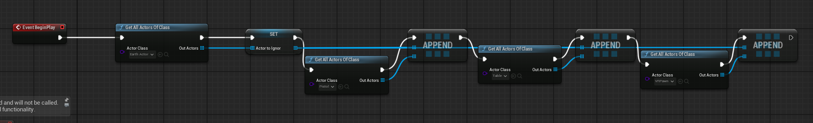

# How to create an Alien Invasion in your living room 

# Software
## Unreal Engine 5 Preparations
For this project, Unreal Engine 5.5.3 is used. At the current state, this is the newest version. It is important to get the matching Meta XR plugin version, which in this case is 1.104.0.

Make sure to add the Android platform to your Unreal Engine version in the Epic Games Launcher under your version's options.

## Android Studio

To build the game for the Quest 3, you will need "Android Studio Koala Feature Drop" 2.1.2024, released on August 29, 2024. This must also match the version of Unreal Engine 5 you are using. To ensure compatibility, visit [this link](https://dev.epicgames.com/documentation/en-us/unreal-engine/set-up-android-sdk-ndk-and-android-studio-using-turnkey-for-unreal-engine), which explains how to set up the build pipeline with the correct versions. However, not everything worked as expected.

First, when installing Android Studio, make sure to install it in the standard path. Otherwise, Unreal Engine 5 will not find the software automatically, and you will have to set the paths manually.

After installing the correct Android Studio version, start the software, go to **More Actions**, and click on **SDK Manager**.

Under **SDK Platforms**, select **Android 12L ("Sv2")**. This is important; otherwise, it will not be recognized by the engine.

Another crucial setting is the **NDK version**. For some reason, the only stable version for Unreal Engine 5 at the moment is **25.1.8937393**. Choose this for your NDK version.

Some other settings are also important, such as **Google USB Driver** and **Android SDK Platform Tools**. Ensure that you check these options, as shown in the picture.

After this, click **Apply** and close the application.

## Java

Next, download **Java 17** and install it with the standard path set.

## Unreal Project Settings

After installing all third-party software, start Unreal Engine 5 and choose the **VR Template** as your starting project.

Go to Project Settings: 

1. Targeted Hardware

Make sure to set **Optimize Project Settings for Mobile and Scalable** to ensure smooth performance from the beginning.

Under **Supported Platforms**, make sure to check **Android** and **Windows**.

Next, go to **Platforms → Android** and click **Configure Now**. If everything turns green, you are good to go. Under **Minimum SDK** and **Target SDK**, type **32**, as this is the proper SDK for the Quest 3. You could set the minimum SDK to **29** to make it compatible with Quest 1 and 2, but since we are using **Mixed Reality Features**, this doesn’t really make sense in our case.

Also, check this option to package your game into a single `.apk` file. This will be needed later when installing the game on the Quest 3.

Scroll down to **Google Play Services** and click **Configure Now**.

In the next step, go to **Android SDK** under **Platforms** and ensure it looks like the picture. If the paths do not appear, you must manually search for the installation.

Close your **Project Settings** and, in the Unreal Engine 5 Editor, click on **Platforms**.

You must build for **Shipping** to test the game on your Quest 3. **Debug builds will not work.**

Make sure to **build your project** before proceeding to confirm that everything functions properly.

After building, you will get a folder containing some files.

## SideQuest and Meta Quest Link

Install **Meta Quest Link** and **SideQuest** on your PC or Mac, and make sure your headset is connected via Quest Link.

SideQuest should recognize the device as well.

Ensure the connection is **green**, then click on the symbol circled in red. From there, choose your **.apk** file with the largest file size from your build folder to install it on your headset. When SideQuest displays **Success**, you will find the game under **Apps** in your Quest 3.

## Meta XR 

Place the downloaded **Meta XR Plugin** in your engine installation folder under **Plugins/Marketplace**. If no **Marketplace** folder exists (as in newer versions using FAB), simply create one. Then, navigate to **Edit → Plugins** in the top bar, activate the **Meta XR Plugin**, and deactivate the **Open XR Plugin**.

## Finally start Creating Your Game

In this case, we are creating a **UFO shooter game**, where you must defend Earth with your blaster from an alien invasion.

## Enable PassThrough

First, enable **Developer Features** in your Quest 3 under **Settings → Beta** and enable **Developer Runtime Features** and **Passthrough over Oculus Link**. You may need to set up a **developer account** via the Meta website.

Next, go to **Project Settings** in Unreal under **Rendering → Postprocessing**. Find the option **Enable Alpha Channel Support in Post Processing** and set it to **Allow Through Tonemapper**. Scroll down to the **Meta XR Plugin** section and ensure your settings match the picture.

Then, restart the editor.

Make sure that **MSAA 4X** is enabled under **Anti-aliasing Method**, as this is the best method for Quest 3.

Next, go to your **VR Pawn Blueprint** and add an **OculusXRPassthroughLayer** to your camera. In the **Details Panel** of your layer, enable **Support Depth**.

Set **Stereo Layer Shape** to **Reconstructed Passthrough Layer** and **Layer Placement** to **Underlay**. Ensure your **Engine Scalability** is set to **Epic**. If you have disabled **Open XR**, you should now see passthrough within **VR Preview**.

 ## Using RoomSetups for the Games

 First, go to **Settings** to set the environment and scan your room where you want to play. The Meta Quest system is very advanced; it can recognize tables, storage, beds, windows, and more. For our use case, we could use the system with wall detection, but for performance reasons, we use only the **room scan mesh**. Scan your room and then don't forget to give your app permission under **Privacy & Security** to access your room scan data. Since this is sensitive data, the system acts carefully and does not allow random apps to access it.

After granting permission, you can start the game. For testing purposes, I created a simple **grid material** to visualize the room scan mesh.

Set your **standard material** to these settings and search for **wireframe**. This material enables you to see the room scan mesh for debugging purposes.

We could use the **smart scan** for recognizing objects like walls, beds, and doors, but for performance reasons, we chose only the room scan.

The **EarthActor** is represented by a **low-poly static mesh of Earth**. From this point, the system shoots **linetraces (raycasts in Unity)** into the scene and collides with the room mesh. At the collision points, we calculate the normal and the **Z-rotation** to determine the **normal vector** of the triangle. This allows us to spawn **portals oriented to the walls**, making it look like UFOs are coming out of the walls. We could use wall, table, and other meshes, but the **room mesh** is the most accurate. To use this, there is an actor provided by **Meta XR** called **OculusXRSceneActor**.

## Spawning
So in the end, we create an actor called **EarthActor**, which periodically shoots **linetraces**. The random positions generated from these traces are used to spawn a **UfoSpawner**. The **UfoSpawner** is a particle system that spawns the actual actor **UFO1**, for example. The **UFO** then gets the position of the Earth and moves towards it.

Here comes the **critical part**: Currently, each UFO is its **own actor**, with its own **tick function** and logic, which is not the most performant approach. The following images showcase its functionalities:

If the UFO gets Hit once it gets destroyed at least for the first wave UFO. The second wave gets spawned not that often but can withstand 20 shots and deal significant more damage (just a showcase on how the gamemechanic can be expandet). 

The whole prototype works pretty well and could be extended by adding more weapons and a progression system as well as ammunition and power ups. 

The spawning of the **UFOs** works with a **simple timer**: after **60 seconds**, the **second wave** appears. This is just a **basic implementation** of how a **progression system** could work.

Overall, this system demonstrates how to create a **Mixed Reality Game** with **Unreal Engine**. Although it is not as straightforward as **Unity**, it is still feasible. Additionally, Unreal Engine provides benefits like a **high-quality rendering system** and **better performance with high-quality models**.

The **blasters** are taken from the **VR Standard Project**. For all textures, a **specialized outline material** is used because **normal ones do not work well with VR screenspace**.

 This gives the project a **toon-like touch**, which works better for **lower-performance graphics**. The whole project runs at **stable 72 FPS**, except when the **UFO count gets too high** and the **particle systems of the bullets** become excessive. 

**Optimizing** this kind of game requires careful **settings and tweaking**. The most **performant approach** would be to render the **UFOs as Instanced Static Meshes** instead of individual actors. 

Additionally, the **Adreno 740 GPU**, integrated into the **Snapdragon XR2 Gen 2 CPU**, is **significantly less powerful** than **standard PC GPUs**. Thus, **normal PC optimization techniques are not as effective**. It is crucial to **minimize draw calls and CPU overhead** when developing for VR.

This should always be considered when creating a **VR game**.

